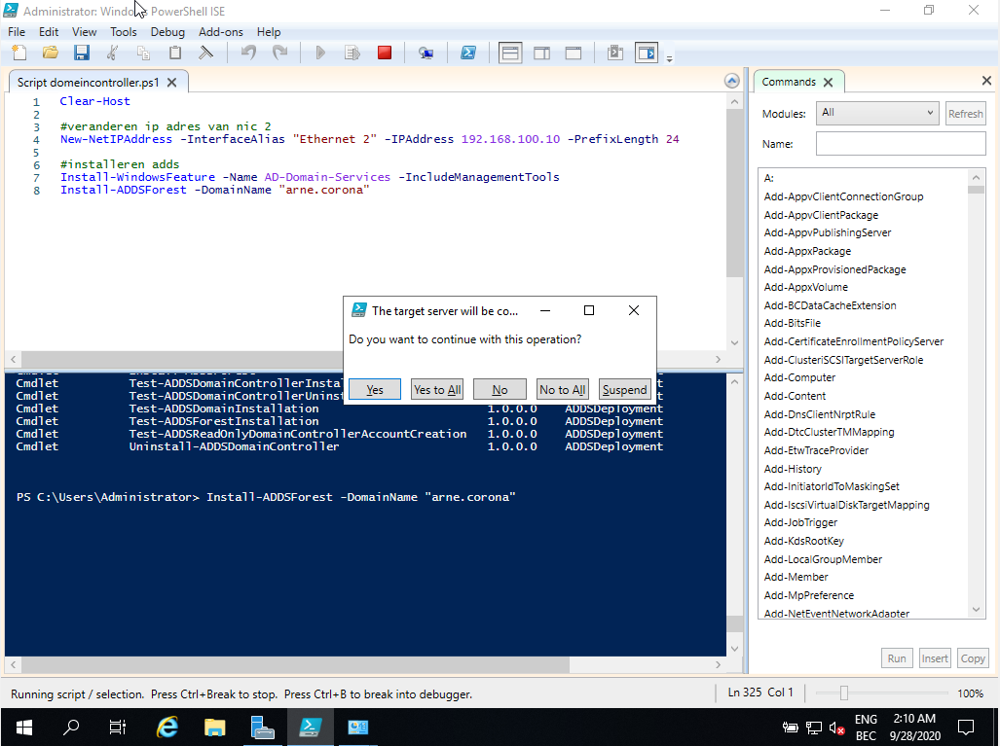

Voor de installatie van de domeincontroller maken we gebruik van een nieuwe VM. Deze vm moet je niet helemaal opnieuw instellen. Ga op virtualbox naar de template vm dat je hebt aangemaakt en klik op clone. Hier kan je de nieuwe vm een naam en plaats geven waar je hem wilt opslaan. Na deze stap wordt je nieuwe vm gecreëerd.

# om de installatie verder te voltooien zullen we gebruik maken van een geschreven powershell script. Dit script zal zorgen voor: goede nic instellingen, installatie adds, installatie dns,..

Wanneer je het script laat runnen kan het zijn dat hij het wachtwoord vraagt, dan geef je dit gewoon in, en yes to all. 

De dns roll wordt automatisch geïnstalleerd wanneer we het forest met domein arne.corona instelde. 
