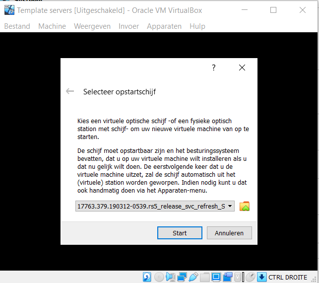
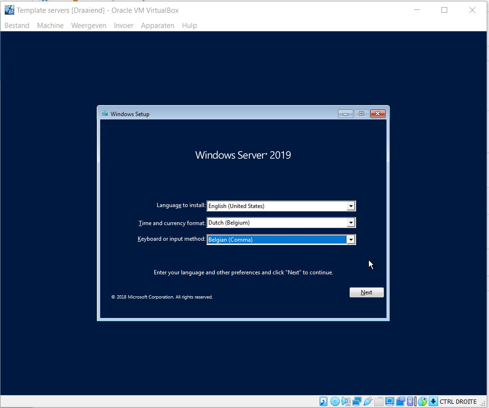
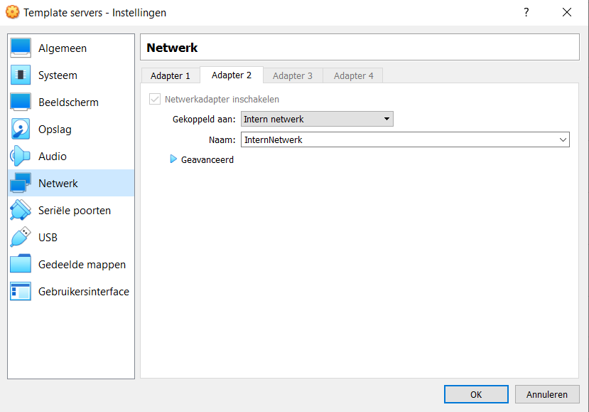
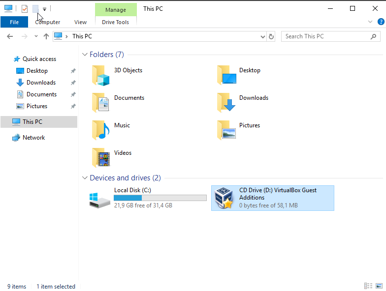
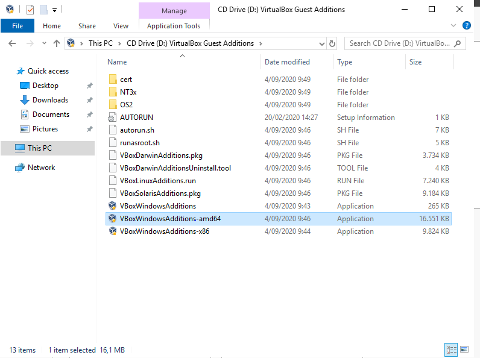
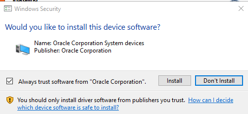
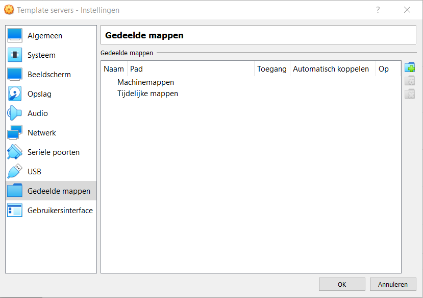
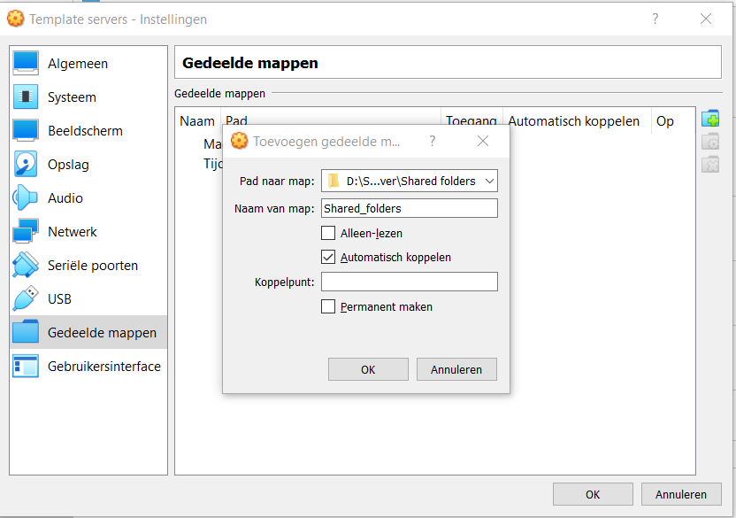

# Aanmaken template voor de servers te deployen.

## In dit document maken we een template aan zodat we gemakkelijk en snel een vm kunnen opzetten. Hierdoor moeten we niet voor elke server dezelfde dingen te doen (zoals shared folder maken, de basisinstellingen) en zal het testen ook vlotter gaan.

Als eerste stap zal u een nieuwe vm moeten aanmaken met naam naar keuze (wij gebruiken als naam template servers), hierna kan je alle default instellingen nemen.
Start de vm op en gebruik als opstartschijf de iso voor windows server 2019.

Stel voor de tijd en keyboard input de volgende instellingen in. Hierna kan je op installeren drukken.

Gebruik de Windows server 2019 standard evaluation (desktop experience) versie

Accepteer de license terms en druk op next. Kies voor custom install en druk nogmaals op next.

Als wachtwoord gebruiken we Admin2020

Zorg ervoor dat naast het NAT netwerk er ook nog een 2de adapter wordt ingesteld voor een intern netwerk die later zal worden ingesteld per vm.

Nu zullen we onze vm template uitbreiden met de virtualbox guest additions, dit gaat ons in staat stellen om shared folders te gebruiken. Dit zal ervoor zorgen dat we gemakkelijk scripts kunnen uitwisselen tussen de vm's en onze eigen computer. De guest additions kan je online downloaden, deze kan je bij de vm zetten doormiddel van apparaten -> invoegen guest additions.
Klik in de verkenner bij this pc op de CD drive.

Hierna druk je op VBoxWindowsAdditions-amd64 

Bij de setup druk je op next -> next -> next
Er zal een pop-up verschijnen die vraagt om de software te installeren druk hierbij op install.

De laatste stap in dit kleine proces is op finish drukken, hierbij gaat de computer zich heropstarten. 

Als laatste stap van deze vm template gaan we de shared folder instellen zodat we gemakkelijk scripts op de vm's kunnen zetten.
Ga in virtualbox naar de vm en klik op instellingen -> gedeelde mappen

Klik rechts boven op nieuwe folder toevoegen. Hier zal je het pad moeten ingeven naar de folder waar de scripts zich zullen bevinden. Ook zal je automatisch koppelen moeten aanvinken.

Dit was de laatste stap voor onze vm template. Vanaf nu kunnen we doorgaan met het installeren van de andere vm's.

